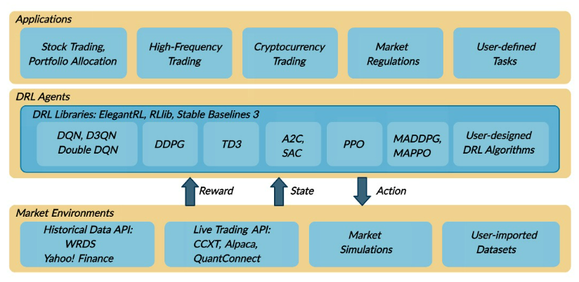

# Portfolio-Allocation-tutorial
This git repository is for "Portfolio allocation tutorial with python"

**My Portfolio is constructed by several model algorithms.**

### * Process for Algorithmic Trading

### * Get Data from FinanceDataReader

### * For low risk, Pre-Investment is done with bond!

***You can run the codes with Colab!***
  

## 1. Markowitz Portfolio
Markowitz Portfolio is "Modern Portfolio Theory" which is one of the most popular Portfolio Optimization theory. 

We can get "minimum volatility portfolio" or "maximum return portfolio" which is in efficient frontier with red line. 

Also, we can calculate expected return and volatility(risk).
  

## 2. HRP Portfolio
HRP is the method that may can make up Markowitz model with hierarchical tree algorithm which is clustering stocks.

***[Reference URL](https://medium.com/@orenji.eirl/hierarchical-risk-parity-with-python-and-riskfolio-lib-c0e60b94252e)***
  

## 3. RL Portfolio
***[Benchmark Gihub](https://github.com/AI4Finance-Foundation/FinRL)***

RL for automatic portfolio allocation based on "FinRL: Deep Reinforcement Learning for Quantitative Finance" which is accepted paper of NeurIPS 2018.

